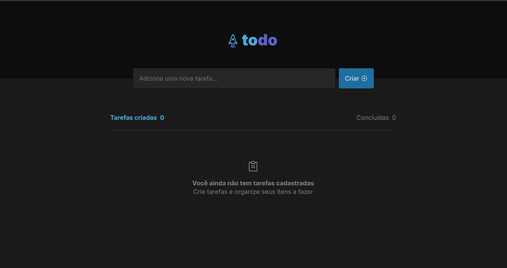

# REACTJS TODO LIST

Developed on the Ignite trail [Rocketseat](https://www.rocketseat.com.br/).

1. Objective: Create a front-end application in ReactJS Version 17 following the layout created in Figma with the functionalities: Add, Remove, and Complete tasks from the task list.

### Front-End

- **VITE** — Pre-configured packer is responsible for all construction parts of the project. [vite website](https://vitejs.dev/)
- **ContextAPI** - Hook a native of React for providing the application schemas, interpreting the relevant information with the entire application [Hooks Docs](https://pt-br.reactjs.org/docs/hooks-intro.html) -**CSS Modules** - It's a way of styling components that react in isolation.

## Applied business rules

- Unable to include a task without text
- Created tasks are born uncompleted by default
- When clicking on a to-do task it is marked as complete
- When you click on a completed task it becomes available again
- When removing a task it is permanently deleted

---

## Shall we have a coffee?

[Portifolio](https://wellpinho.com)  
[LinkedIn](https://linkedin.com/in/wellpinho)
wellpinho@outlook.com - +55 48 9883-34573
